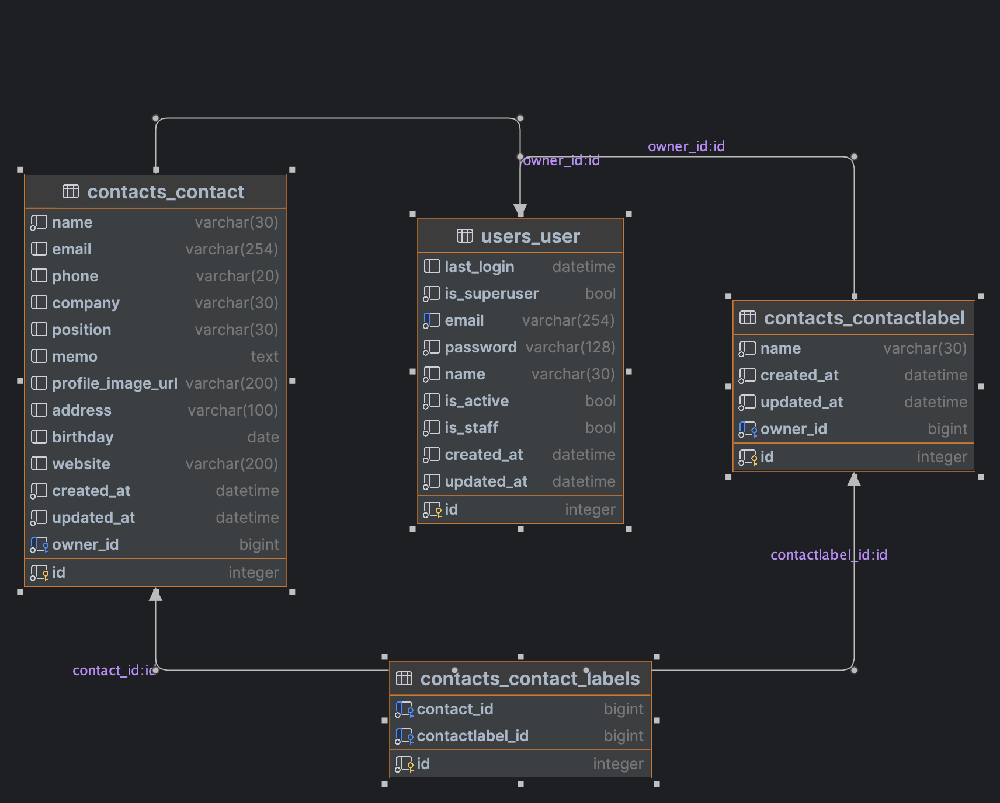

# backend-pre-task

### 서버 실행 방법
```bash
$ cd backend
$ python -m venv venv
$ source venv/bin/activate
$ pip install -r requirements.txt
$ python manage.py migrate
$ python manage.py runserver
```

### API 명세
- [Swagger UI](http://localhost:8000/swagger/)


### ERD



### Django Admin
- [Django Admin](http://localhost:8000/admin/)


### 테스트 아이디 및 비밀번호
- id: tester1@kidsnote.com / pw: zlwmshxm123! (Django admin 계정)
- id: tester2@kidsnote.com / pw: zlwmshxm123!


### 테스트 코드 실행 방법
```bash
$ cd backend
$ python manage.py test
```
